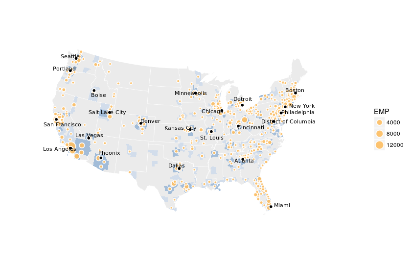

## cbsa_plot
### Recreation of the Times ecommerce employment visualizations

```
git clone https://github.com/stoneyv/cbsa_plot.git
```
  
1. Download the following Census Bureau .txt file into ./data/census/CBP/  
https://www.census.gov/programs-surveys/cbp/data/datasets.html  
cbp15co.txt  
  
2. Download the following Census Bureau population file for CBSA into ./data/census/  
https://www2.census.gov/programs-surveys/popest/datasets/2010-2016/  
https://www2.census.gov/programs-surveys/popest/datasets/2010-2016/metro/totals/  
cbsa-est2016.csv
  
3. Download the following cartographic boundary shapefiles from the Census Bureau into ./data/shapefiles  
https://www.census.gov/geo/maps-data/data/tiger-cart-boundary.html  
a. cb_2015_us_county_20m  
b. cb_2015_us_state_20m  
c. cb_2015_us_cbsa_20m  



