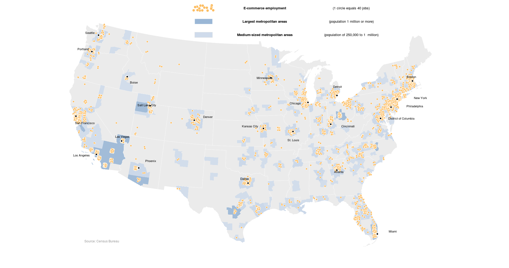
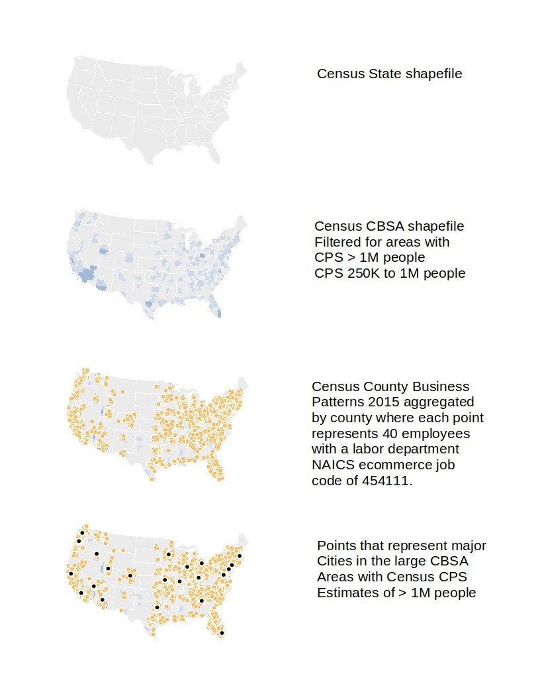

### Recreation of the NY Times ecommerce employment geo visualization

A New York Times article discusses how ecommerce is effecting retail employment over the period of 2012 to 2015. This repository attempts to recreate the geo visualization that has the job of communicating that the ecommerce jobs are mostly located in larger metropolitan areas.
https://www.nytimes.com/interactive/2017/07/06/business/ecommerce-retail-jobs.html

* Currently there are R ggplot2 and python 3.6 matplotlib implementations.  
* There are also some additional examples for using the npm mapshaper utility and QGIS.  





### 1. Clone the git repository
```
git clone https://github.com/stoneyv/cbsa_plot.git
```

### 2. Download the data and shapefiles
If you are running linux or Mac OSX you can open a terminal and run this bash shell script to download the data and unzip it into the required directories.  Windows users might use the newer Ubuntu linux subsytem on Windows 10 or cygwin.
```bash
cd cbsa_plot
chmod +x download-data-cbsa.sh
./download-data-cbsa.sh
```
### 3. Run the Python matplotlib or the R ggplot2 implementation.  

#### R implementation

You need R and rstudio.   
https://www.rstudio.com/products/rstudio/download/

The following CRAN packages are necessary
```
sp, stringr, data.table, dplyr, ggplot2, rgeos, rgdal, RColorBrewer
```
If you have difficulty installing a package look at the depends and imports fields of CRAN package page.
To update a single package

```
install.packages("sp")
```
To update multiple packages at once
```
install.packages(c("sp","stringr","data.table","dplyr","ggplot2","rgeos","rgdal","RColorBrewer"))
```

#### Jupyter ipython implementation

Install the Anaconda python 3.6 distribution  
https://www.anaconda.com/download

Create a conda environment for geopandas  
https://conda.io/docs/user-guide/tasks/manage-environments.html
```bash
# On the windows platform, omit the word "source"
conda create -n geopandas python=3.6 geopandas
source activate geopandas
```
Note that the following commands assume that you have activated the geopandas environment that you created above.  You should see "geopandas" at your command prompt once you activate the environment.  To deactivate the environment you can issue the source deactivate command.

Create a jupyter kernelspec for the geopandas environment  
http://ipython.readthedocs.io/en/stable/install/kernel_install.html#kernels-for-different-environments
```bash
python -m ipykernel install --user --name geopandas --display-name "Python (geopandas)"
```
Install any missing packages  
https://conda.io/docs/user-guide/tasks/manage-pkgs.html#installing-packages
```bash
conda install <package_name>
```
Run the jupyter ipython notebook
```bash
jupyter notebook
```
When you want to change to the regular Anaconda environment you can issue 
```bash
# On the Windows platform omit the word "source"
source deactivate geopandas
```
